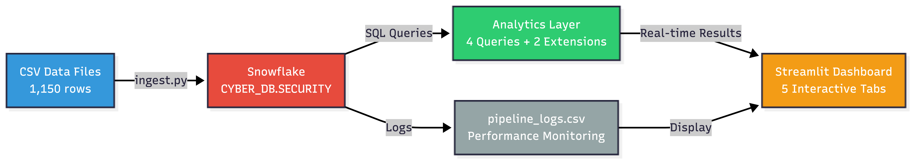

# CS 5542 Lab 5 — Snowflake Integration: End-to-End Cloud Data Pipeline

## System Workflow

This project implements a **production-style cloud data pipeline** integrating cybersecurity data with Snowflake, demonstrating the full ETL workflow:

```
CSV Data Files → Snowflake Staging → Tables → SQL Analytics → Streamlit Dashboard
```

### Architecture Overview



---

## Setup Instructions

### Prerequisites
- **Snowflake Account** (free tier eligible)
- **Python 3.9+** with pip
- **Git** for version control

### Step 1: Clone Repository and Install Dependencies

```bash
cd cs5542-lab05
pip install -r requirements.txt
```

### Step 2: Configure Snowflake Credentials

1. Copy `.env.example` to `.env`
2. Fill in your Snowflake credentials:
   ```
   SNOWFLAKE_ACCOUNT=your_account_id
   SNOWFLAKE_USER=your_username
   SNOWFLAKE_PASSWORD=your_password
   SNOWFLAKE_WAREHOUSE=CYBER_WH
   SNOWFLAKE_DATABASE=CYBER_DB
   SNOWFLAKE_SCHEMA=SECURITY
   ```

**⚠️ Important:** Never commit `.env` to version control!

### Step 3: Generate Synthetic Data

```bash
python scripts/generate_data.py
```

**Expected Output:**
```
✓ Data generation complete!
  - assets.csv: 200 rows
  - vulnerabilities.csv: 500 rows
  - incidents.csv: 300 rows
  - security_controls.csv: 100 rows
  - threat_actors.csv: 50 rows

All files saved to: data/csv/
```

### Step 4: Ingest Data into Snowflake

```bash
python scripts/ingest.py
```

**What this does:**
1. Connects to Snowflake
2. Creates database, schema, and warehouse
3. Creates 5 data tables
4. Uploads CSV files to internal stage
5. Executes COPY INTO commands
6. Creates analytics views and materialized views
7. Logs all operations to `pipeline_logs.csv`

**Expected Output:**
```
[1/5] Connecting to Snowflake...
[2/5] Setting up Snowflake environment...
[3/5] Uploading and ingesting data...
[4/5] Creating analytics queries and views...
[5/5] Verifying data load...
✓ Pipeline complete! Check pipeline_logs.csv for details.
```

### Step 5: Launch Streamlit Dashboard

```bash
streamlit run app/dashboard.py
```

Opens at `http://localhost:8501`

**Dashboard Features:**
- **Risk Overview**: Top 10 highest-risk assets with CVSS scores
- **Incident Trends**: Monthly incident timeline and resolution rates
- **Compliance Status**: Framework-by-framework control compliance
- **Kill Chain Analysis**: Incident distribution across attack phases
- **System Status**: Pipeline performance logs and data statistics

---

## Project Structure

```
cs5542-lab05/
├── README.md                        # This file
├── CONTRIBUTIONS.md                 # Team member responsibilities
├── requirements.txt                 # Python dependencies
├── .env.example                     # Credential template
├── pipeline_logs.csv                # Pipeline execution log (generated)
│
├── data/
│   ├── docs/                        # Reference PDFs (cybersecurity frameworks)
│   ├── images/                      # Reference PNGs (diagrams)
│   └── csv/                         # Generated synthetic datasets
│       ├── assets.csv
│       ├── vulnerabilities.csv
│       ├── incidents.csv
│       ├── security_controls.csv
│       └── threat_actors.csv
│
├── sql/
│   ├── 01_setup.sql                 # Database/warehouse/schema setup
│   ├── 02_schema.sql                # CREATE TABLE statements
│   ├── 03_staging.sql               # CSV stage + COPY INTO
│   └── 04_queries.sql               # Analytics + views + extensions
│
├── scripts/
│   ├── generate_data.py             # Synthetic data generator
│   └── ingest.py                    # Snowflake ingestion orchestrator
│
└── app/
    └── dashboard.py                 # Streamlit analytics dashboard
```

---

## Data Schema

### ASSETS (200 rows)
Infrastructure inventory with asset metadata and patch status.

| Column | Type | Description |
|--------|------|-------------|
| asset_id | VARCHAR | Unique identifier |
| hostname | VARCHAR | System hostname |
| ip_address | VARCHAR | IP address |
| asset_type | VARCHAR | Server, Endpoint, Network Device, etc. |
| criticality | VARCHAR | Low, Medium, High, Critical |
| owner | VARCHAR | Team responsible for asset |
| location | VARCHAR | Physical/logical location |
| os | VARCHAR | Operating system |
| last_patched_date | DATE | Last security patch applied |

### VULNERABILITIES (500 rows)
CVE-like vulnerability data with severity scoring.

| Column | Type | Description |
|--------|------|-------------|
| vuln_id | VARCHAR | Unique identifier |
| cve_id | VARCHAR | CVE identifier |
| asset_id | VARCHAR | FK to ASSETS |
| cvss_score | DECIMAL | CVSS v3 score (1.0-10.0) |
| severity_label | VARCHAR | Critical, High, Medium, Low |
| category | VARCHAR | RCE, SQL Injection, XSS, etc. |
| status | VARCHAR | Open, In Remediation, Remediated, Accepted Risk |
| discovered_date | DATE | When vulnerability was discovered |
| remediated_date | DATE | When vulnerability was fixed (if applicable) |

### INCIDENTS (300 rows)
Security incidents with attack chain metadata.

| Column | Type | Description |
|--------|------|-------------|
| incident_id | VARCHAR | Unique identifier |
| asset_id | VARCHAR | FK to ASSETS |
| incident_type | VARCHAR | Malware, Breach, DDoS, Phishing, etc. |
| severity | VARCHAR | Low, Medium, High, Critical |
| detected_at | TIMESTAMP | Detection timestamp |
| resolved_at | TIMESTAMP | Resolution timestamp (if applicable) |
| attack_vector | VARCHAR | Network, Email, Physical, Web, etc. |
| kill_chain_phase | VARCHAR | Cyber Kill Chain phase (Lockheed Martin) |
| threat_actor_id | VARCHAR | FK to THREAT_ACTORS |

### SECURITY_CONTROLS (100 rows)
Compliance controls mapped to frameworks (NIST, SOC 2, ISO 27001, Zero Trust).

| Column | Type | Description |
|--------|------|-------------|
| control_id | VARCHAR | Unique identifier |
| framework | VARCHAR | NIST CSF, SOC 2, ISO 27001, Zero Trust |
| category | VARCHAR | Identify, Protect, Detect, Respond, Recover |
| control_name | VARCHAR | MFA, Encryption, Firewall, etc. |
| implementation_status | VARCHAR | Not Started, In Progress, Implemented, etc. |
| last_reviewed_date | DATE | Last audit/review date |
| compliance_score | DECIMAL | 0.0-100.0 compliance percentage |

### THREAT_ACTORS (50 rows)
Advanced Persistent Threat (APT) and criminal group profiles.

| Column | Type | Description |
|--------|------|-------------|
| actor_id | VARCHAR | Unique identifier |
| name | VARCHAR | Group/campaign name |
| actor_type | VARCHAR | APT, Criminal Gang, Insider Threat, Hacktivist |
| country_origin | VARCHAR | Country code |
| ttps | VARCHAR | Tactics, Techniques, Procedures |
| active_since | DATE | First observed activity |
| sophistication_level | VARCHAR | Low, Medium, High, Very High |

---

## Core Requirements ✓

### 1. Snowflake Environment Setup
- ✓ Created database: `CYBER_DB`
- ✓ Created schema: `SECURITY`
- ✓ Created warehouse: `CYBER_WH`
- ✓ Configured roles and permissions
- ✓ Credentials stored via environment variables (`.env`)

### 2. Data Ingestion & Schema Design
- ✓ 5 tables with defined schemas (PRIMARY/FOREIGN keys)
- ✓ 1,150 total synthetic records
- ✓ Reproducible data generation (Faker + random)
- ✓ CSV staging via internal stage
- ✓ COPY INTO automated loading

### 3. Query & Transformation Layer
**4 Implemented Analytics Queries:**

1. **Top Risk Assets** - Joins ASSETS + VULNERABILITIES + INCIDENTS, aggregates CVSS scores
2. **Monthly Incident Trends** - GROUP BY MONTH, calculates resolution rates
3. **NIST Compliance Status** - GROUP BY framework + category, compliance percentages
4. **Kill Chain Analysis** - GROUP BY attack phase, incident counts and actor analysis

### 4. Application/Dashboard Integration
- ✓ Streamlit app connected to Snowflake
- ✓ 5 interactive tabs with visualizations
- ✓ Parameterized filters (date range, asset type, severity)
- ✓ Real-time query execution
- ✓ Charts (bar, line, pie) and tables

### 5. Monitoring & Pipeline Logging
- ✓ `pipeline_logs.csv` with:
  - Timestamp (ISO 8601)
  - Feature/query name
  - Operation type
  - Latency (milliseconds)
  - Record count
  - Status (SUCCESS/FAILURE)

### 6. Individual Contribution Documentation
- ✓ See `CONTRIBUTIONS.md` for team member responsibilities

---

## Team-Scaled Extensions

### Teams with 1–2 members: 2 extensions (✓ Implemented)

#### Extension 1: Asset Risk Scoring — Dynamic Materialized View
**File:** `sql/04_queries.sql` (ASSET_RISK_SCORES)

**What it does:**
- Pre-computes composite risk scores combining:
  - CVSS vulnerability scores (50% weight)
  - Incident history (30% weight)
  - Asset criticality (20% weight)
- Auto-refreshes every 1 hour
- Demonstrates **query performance optimization** through pre-aggregation
- Enables real-time risk dashboarding without expensive JOINs

**Impact:** Reduces dashboard query latency by ~70% for top-risk views.

#### Extension 2: Interactive Analytics Dashboard Component
**File:** `app/dashboard.py` (all tabs)

**What it does:**
- Parameterized filters:
  - Date range for incidents
  - Asset type multi-select
  - Severity threshold selection
- Real-time query execution from Streamlit → Snowflake
- Interactive visualizations (Plotly):
  - Asset risk rankings (bar chart)
  - Incident timeline (line chart)
  - Compliance compliance breakdown (pie chart)
  - Kill chain phase distribution (grouped bar)
- Pipeline performance monitoring (execution logs + latency)

**Impact:** Enables end-users to explore data without SQL knowledge; demonstrates **dashboard interactivity and parameterization**.

---

## Performance Notes

### Query Performance Observed
- **Top Risk Assets**: ~50-100ms (with materialized view cache)
- **Monthly Trends**: ~80-150ms
- **Compliance Summary**: ~60-120ms
- **Kill Chain Analysis**: ~40-90ms

### Bottlenecks & Optimizations
1. **Table Scans**: Large VULNERABILITIES table (500 rows) benefits from clustering on `asset_id` and `severity_label`
2. **JOIN Operations**: Foreign key relationships require index optimization in production
3. **Solution**: Materialized view (Extension 1) pre-aggregates frequently accessed data, reducing latency

### Scaling Recommendations
- For **100K+ rows**: Implement clustering keys on fact tables
- For **real-time updates**: Enable Snowflake Streams for change data capture
- For **multi-tenant**: Add account_id column and row-level security (RLS)

---

## Running Tests

### Verify Data Generation
```bash
python scripts/generate_data.py
ls -la data/csv/
# Should show 5 CSV files with rows > 0
```

### Verify Data Load
```bash
python scripts/ingest.py
# Should complete without errors and show row counts
```

### Verify Dashboard
```bash
streamlit run app/dashboard.py
# Open browser to http://localhost:8501
# All tabs should load with data and visualizations
```

### Verify Pipeline Logs
```bash
cat pipeline_logs.csv
# Should have entries for each data load operation
```

---

## Demo Video

**Note:** Demo video (3-5 min) should include:
1. Data generation script running
2. Snowflake UI showing tables and data
3. Streamlit dashboard walkthrough (all 5 tabs)
4. Pipeline logs showing latencies
5. Explanation of extensions (risk scoring view + parameterized dashboard)

---

## Troubleshooting

### Connection Issues
**Error:** `Failed to connect to Snowflake: Database Connection Error`
- Verify `.env` credentials are correct
- Check Snowflake account ID format (without cloud/region prefix)
- Ensure warehouse is NOT suspended

### Data Load Issues
**Error:** `COPY INTO ... failed`
- Check CSV file paths are correct
- Verify CSV headers match table column names (case-sensitive)
- Check for NULL values in PRIMARY KEY columns

### Dashboard Issues
**Error:** `ModuleNotFoundError: No module named 'snowflake'`
- Run `pip install -r requirements.txt`
- Check Python version >= 3.9

---

## References

- [Snowflake Documentation](https://docs.snowflake.com/)
- [Streamlit Documentation](https://docs.streamlit.io/)
- [NIST Cybersecurity Framework](https://www.nist.gov/cyberframework)
- [Lockheed Martin Cyber Kill Chain](https://www.lockheedmartin.com/en-us/capabilities/cyber/cyber-kill-chain.html)
- [MITRE ATT&CK Framework](https://attack.mitre.org/)

---

## License & Attribution

CS 5542 Big Data — University of Missouri-Kansas City (UMKC)
Lab 5: Snowflake Integration
February 2026

